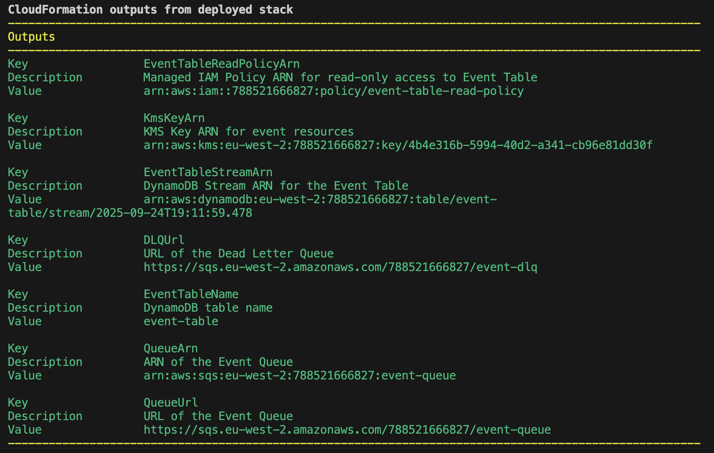
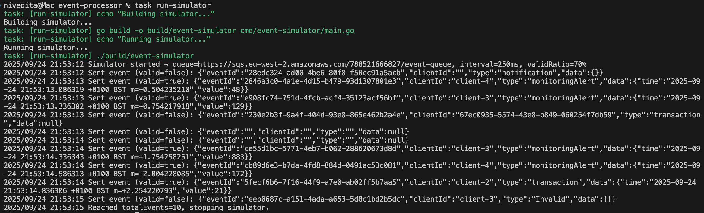
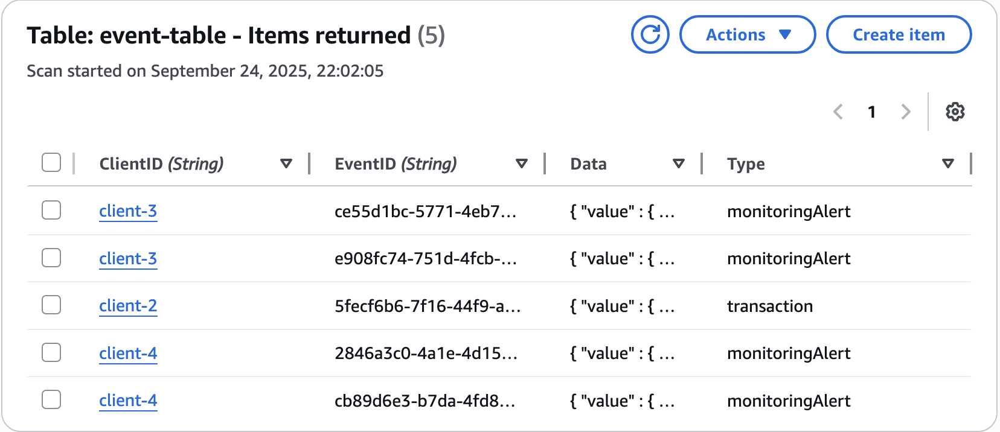
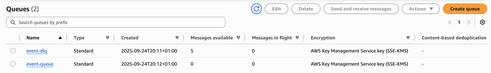
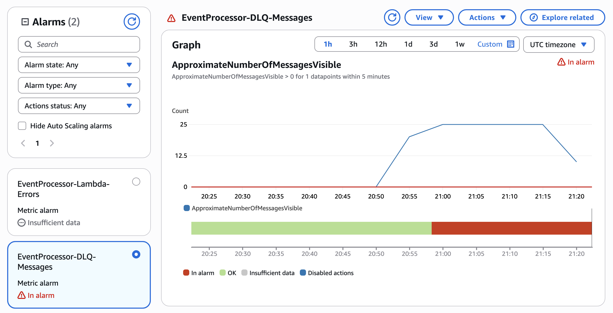

# Event Processor

[Overview](#overview)  
[Architecture and Design Considerations](./documentation/architecture.md)  
[AWS Deployment](#aws-deployment)  
[LocalStack Deployment](#localstack-deployment)

## Overview
This component will function as a reactive service, always available to receive events from a specified source. It will handle validation, triage, and persistence, making the event ready for delivery to the final client by another service later.

## Pre-Requisites
The following are required as part of pre-requisite setup to be able to deploy this service on AWS or Localstack
- Go
- Go Task
- AWS CLI
- SAM CLI
- Docker*
- Localstack CLI*
- AWS Local CLI (Optional)*  
*The latter 3 are only needed for LocalStack deployment

## AWS Deployment
This project uses Go Task to consolidate build and deploy commands as tasks to simplify and automate the steps.  
To deploy the service on AWS, follow the below steps:  
1. Configure AWS credentials, if not already configured.
2. Configure environment variables required for deployment in `eventprocessor.env` file.
2. Run `task init`: This task is only needed to be run once to create a deployment bucket which is required to package SAM template.
2. Run `task`: This task comprehensively builds the Go lambda code, packages SAM template and deploys it.

__Cleanup__  
`task delete`: Deletes the created stack

__Sample Deployment Output__  

## LocalStack Deployment
This project uses Go Task to consolidate build and deploy commands as tasks to simplify and automate the steps.  
To deploy the service on AWS, follow the below steps:  
1. Run `task localstack-up`: This task starts the localstack as a container on docker.
2. Run `task localstack-init`: This command is only needed to be run once to create a deployment bucket which is required to package SAM template.
3. Run `task localstack`: This task comprehensively builds the Go lambda code, packages SAM template and deploys it.

__Cleanup__  
`task localstack-down`: This task stops and removes the localstack container.

## Event Simulation (Event Producer)
The event producer/simulator is a Go program that can generate a number of valid/invalid events and send them to the event queue SQS at a fixed rate.
The total number of events, proportion of valid/invalid events and the rate are all configurable through an environment file.

__Steps__  
1. Configure the QUEUE_URL and other variables for event simulation in `eventsimulator.env`.  
Note: VALID_RATIO is a probability (0.0–1.0) for an event being valid. The actual counts may vary, especially when TOTAL_EVENTS is small.
2. Run `task run-simulator`: This task builds the simulator app and runs it.

__Sample Run__ 

Output:
  

Event Table:
  

Event Queue and DLQ:
  

CloudWatch Alarms:

