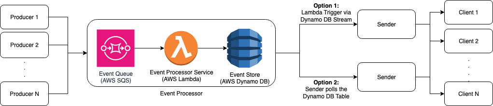

# Architecture and Design Considerations

## High-Level Architecture

The event processor consists of three components that help it receive, process and persist events respectively:

#### 1) Event Queue (AWS SQS)
- This receives the events and channels them to the lambda function for processing in no particular order. 
- The batch-size for processing queued events can be configured based on expected throughput. For low throughput workload, a lower batch-size like 1-2 helps keep end-to-end latency low. For high throughput workloads the batch-size may be increased to 5-10. 
- If lambda fails to process any event due to any error, it is retried for a configurable number of times and then sent to Dead Letter Queue (DLQ).
- Message queue was chosen to receive the events to allow decoupled and asynchronous communication between producers and event processor.

__Integration with Producer__
- The producer can write to the SQS using the write policy for it that's defined and exported through the AWS CFN template.
- Since the event processor is meant to process events for multiple clients, it's a multi-tenant architecture. As a recommended approach, the producers should include `MessageGroupId` within the SQS message with the Client ID value to enable queue fairness for client delivery and to avoid noisy neighbour problem. [Reference: [Amazon SQS Fair Queues](https://docs.aws.amazon.com/AWSSimpleQueueService/latest/SQSDeveloperGuide/sqs-fair-queues.html)]

### 2) Event Processor Function (AWS Lambda)
- The lambda function processes events received from Event SQS.
- It was chosen to perform the processing of events as it is perfectly suited for microservices such as this with benefits such as no operational overhead, elastic scalability and pay per use. 
- This function performs validation, triage and persistence of the received event as per the requirement.

__Validation__
- It validates the SQS message body to be in line with the expected format for an event message.
- Further, it validates that the event `type` is one of the recognized valid event types. 

__Persistence__
- After validation (any other business-logic/processing [No current requirement]), it persists the successfully validated and processed events to an event store.

### Event Store (AWS Dynamo DB)
- A Dynamo DB Table is used to store event records, partitioned on `ClientID` and sorted by `EventID`.
- DynamoDB is a NoSQL database, which fits our use case well because the `data` field of an event may vary across event types and could contain nested structures. The schema flexibility of a NoSQL database supports this requirement without the overhead of rigid relational models.
- Other than that, Dynamo DB offers low latency, is fully AWS-managed, highly available, scalabe and resilient through multi-AZ deployment.

__Integration with `Sender`__
- We have two options for further integration with Sender:
*1. Dynamo DB Stream Trigger*  
- If the `Sender` service is setup as an AWS Lambda function, then it can be invoked automatically via DynamoDB Streams whenever a new event is written to the table. 
- This is a great low-latency option to ensure delivery to clients in real-time. 
- The DynamoDB stream is defined and exported within the AWS CFN template to support this option.
2. Polling of new events via `Sender` service  
- Another option is that the `Sender` service can periodically query DynamoDB for new events. 
- This option offers control of event delivery pace at the trade-off of higher latency. 
- A read policy is defined and exported within the AWS CFN template to support this option.

## Considerations

### Security

### Monitoring and Alerts

